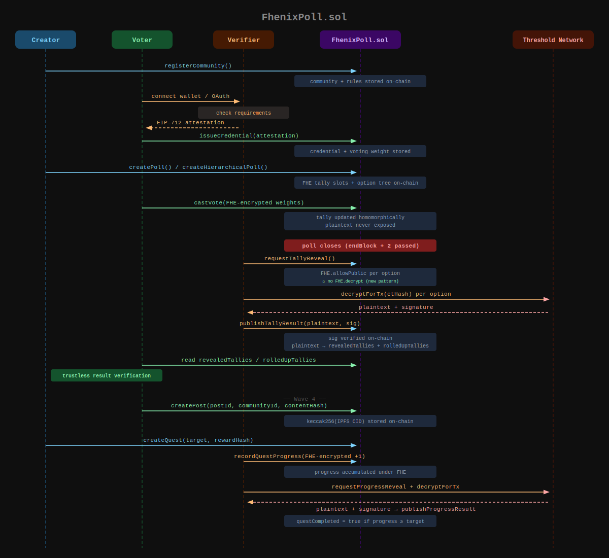

# ZKPoll

[Privacy-preserving ranked-choice voting powered by Fully Homomorphic Encryption (FHE) on Fhenix](https://fhenix-poll.vercel.app) / Arbitrum Sepolia. Vote totals accumulate homomorphically under encryption — the plaintext is only revealed after the poll closes via the Threshold Network.

**Deployed contract (Arbitrum Sepolia):** `0x9dC0044FdB877F1F017D5853150b0B9725b26397`

## How it works



| Step | Actor | Action |
|------|-------|--------|
| 1 | **Creator** | `registerCommunity()` → community + membership rules stored on-chain |
| 2 | **Voter** | Connects wallet / OAuth → Verifier checks requirements off-chain |
| 3 | **Verifier** | Returns EIP-712 attestation to voter |
| 4 | **Voter** | `issueCredential(attestation)` → credential + voting weight stored on-chain |
| 5 | **Creator** | `createPoll()` or `createHierarchicalPoll()` → FHE tally slots + option tree on-chain |
| 6 | **Voter** | `castVote(FHE-encrypted weights)` → tally updated homomorphically, plaintext never exposed |
| 7 | *(on-chain)* | Poll closes when `endBlock + 2` L1 blocks pass |
| 8 | **Verifier** | `requestTallyReveal()` → `FHE.allowPublic` per option *(no `FHE.decrypt` — new SDK pattern)* |
| 9 | **Verifier** | `decryptForTx(ctHash)` per option against the **Threshold Network** |
| 10 | **Threshold Network** | Returns `plaintext + signature` |
| 11 | **Verifier** | `publishTallyResult(plaintext, sig)` → sig verified on-chain, written to `revealedTallies` + `rolledUpTallies` |
| 12 | **Voter** | Reads `revealedTallies` directly from contract → **trustless result verification** |
| 13 | **Voter** | `createPost(contentHash)` → IPFS content hash stored on-chain *(Wave 4)* |
| 14 | **Creator** | `createQuest(target)` → quest defined on-chain *(Wave 4)* |
| 15 | **Verifier** | `recordQuestProgress(FHE-encrypted +1)` → progress accumulated under FHE *(Wave 4)* |
| 16 | **Verifier** | `requestProgressReveal` + `decryptForTx` + `publishProgressResult` → quest completed if progress ≥ target *(Wave 4)* |

## Features

### Communities
- Create a community with name, description, logo, and credential type
- Define membership requirements with `AND`/`OR` group logic — mix token balance, NFT ownership, social follows, Discord roles, GitHub accounts, and more
- Community metadata pinned to IPFS via Pinata (required for persistence)
- Only the community creator can create polls

### Credentials
- Verifier checks requirements off-chain, returns an EIP-712 signed attestation
- Voter's wallet submits attestation to `issueCredential()` on-chain
- Credentials have an on-chain expiry block
- Credentials Hub shows per-community eligibility and lets users claim or renew

### Voting
- **Flat polls** — ranked-choice ballot, voters rank up to 32 options
- **Hierarchical polls** — options have sub-options (up to 4 levels deep, 8 per parent); option tree stored on-chain with `parentId` and `childCount`; sub-category rollup tallies computed on-chain via `rolledUpTallies`
- Each ranking maps to an encrypted weight submitted to `castVote()` — the contract adds it homomorphically to the running FHE tally
- Double-vote prevention via on-chain mapping

### Tally & Results
- After poll closes, `requestTallyReveal()` calls `FHE.allowPublic` per option (no `FHE.decrypt` — new pattern)
- Tally runner calls `decryptForTx` off-chain, then `publishTallyResult` with Threshold Network signature
- Results page reads `revealedTallies` directly from the contract
- Hierarchical polls show nested tree results with `rolledUpTallies` for parent nodes
- Automated tally runner checks every 60 seconds; manual trigger via `POST /admin/tally/:pollId`

### Community Posts
- Credentialed members can post content (title + markdown body)
- Content stored on IPFS; `keccak256(CID)` stored on-chain via `createPost()`
- Gated communities require a valid credential to post

### Community Quests
- Community creators define quests with type (`VOTE_COUNT`, `REFERRAL_COUNT`, `CREDENTIAL_AGE`), target, and reward
- Progress tracked as FHE-encrypted `euint32` — individual progress stays private
- Quest runner auto-scans `VoteCast` events and records encrypted progress increments on-chain
- Completion verified via `requestProgressReveal` + `publishProgressResult` with Threshold Network signature

### Voting power decay
```
Period 1: 100% → Period 2: 50% → Period 3: 25% → Period 4: 12.5% → Period 5: 6.25% → deactivated
```
`CountedVotes (CV) = EligibleVotes (EV) × VotingPower% (VP)`

## Project structure

```
zkpoll/
├── contracts/
│   └── contracts/FhenixPoll.sol   # registerCommunity, createPoll, createHierarchicalPoll,
│                                  # issueCredential, castVote, requestTallyReveal,
│                                  # publishTallyResult, createPost, createQuest,
│                                  # recordQuestProgress, requestProgressReveal,
│                                  # publishProgressResult
├── frontend/
│   └── src/
│       ├── pages/           # PollFeed, CommunityFeed, CommunityDetail (Polls/Posts/Quests tabs),
│       │                    # PollDetail, PollResults (hierarchical tree), CredentialsHub,
│       │                    # MyVotes, CommunityPosts, CommunityQuests
│       ├── components/      # CreateCommunityWizard, CreatePollWizard (flat + hierarchical),
│       │                    # CredentialHub, VotingMode, CreatePostModal, QuestCard
│       ├── hooks/           # useVoting, useCredentialHub, usePosts, useQuests,
│       │                    # useCofheClient, useWriteContract
│       └── lib/             # fhenix.ts, verifier.ts, cofhe.ts (sdk/web singleton), decay.ts
├── verifier/
│   └── src/
│       ├── index.ts         # REST API (communities, polls, posts, quests, OAuth, verify)
│       ├── posts.ts         # File-backed post store
│       ├── quests.ts        # File-backed quest + progress store
│       ├── quest-runner.ts  # Background quest progress loop (120s interval)
│       ├── tally.ts         # FHE tally decryption (CoFHE SDK + viem)
│       ├── tally-runner.ts  # Background tally loop (60s interval)
│       ├── oauth.ts         # Twitter, Discord, GitHub, Telegram OAuth
│       ├── issuer.ts        # EIP-712 credential attestation signing
│       └── checkers/        # Per-requirement-type check implementations
└── (no local storage — all data persists on IPFS via Pinata)
```

## Quick start

### Verifier
```bash
cd verifier
cp .env.example .env
# Fill in: VERIFIER_PRIVATE_KEY, FHENIX_CONTRACT_ADDRESS, DEPLOYMENT_L2_BLOCK
npm install && npm run dev
```

### Frontend
```bash
cd frontend
cp .env.example .env
# Set VITE_CONTRACT_ADDRESS and VITE_VERIFIER_URL
npm install && npm run dev
```

## Environment variables

### `frontend/.env`

| Variable | Description |
|---|---|
| `VITE_CONTRACT_ADDRESS` | Deployed FhenixPoll contract address |
| `VITE_VERIFIER_URL` | Verifier backend URL (default: `http://localhost:3001`) |
| `VITE_CHAIN_ID` | `421614` for Arbitrum Sepolia |
| `VITE_DEV_MODE` | `true` to use raw block counts for poll duration |

### `verifier/.env`

| Variable | Required | Description |
|---|---|---|
| `FHENIX_CONTRACT_ADDRESS` | Yes | Deployed FhenixPoll contract address |
| `VERIFIER_PRIVATE_KEY` | Yes | EVM private key — signs EIP-712 attestations + submits tally txs |
| `DEPLOYMENT_L2_BLOCK` | Yes | L2 block when contract was deployed (for efficient event scanning) |
| `FHENIX_RPC_URL` | No | RPC endpoint (default: Arbitrum Sepolia public RPC) |
| `ADMIN_SECRET` | No | Secret header for admin endpoints |
| `ALCHEMY_API_KEY` | EVM checks | Token balance, NFT, on-chain activity |
| `TWITTER_CLIENT_ID/SECRET` | X OAuth | X connect flow |
| `DISCORD_BOT_TOKEN` | Discord | Guild membership checks |
| `DISCORD_CLIENT_ID/SECRET` | Discord OAuth | Discord connect flow |
| `GITHUB_CLIENT_ID/SECRET` | GitHub OAuth | GitHub connect flow |
| `TELEGRAM_BOT_TOKEN/USERNAME` | Telegram | Widget auth |
| `PINATA_JWT` / `PINATA_GATEWAY` | **Required** | IPFS storage — all community/poll/post/quest data persists on IPFS (no local files) |
| `APP_URL` | OAuth | Verifier's public URL for OAuth callbacks |

## Contract functions

| Function | Caller | Description |
|---|---|---|
| `registerCommunity` | Community creator | Register community on-chain |
| `createPoll` | Community creator | Create flat poll (2–32 options) |
| `createHierarchicalPoll` | Community creator | Create poll with on-chain option tree |
| `issueCredential` | Voter | Submit EIP-712 attestation to get credential |
| `castVote` | Voter | Submit FHE-encrypted per-option weights |
| `requestTallyReveal` | Anyone (after poll ends) | `FHE.allowPublic` per option |
| `publishTallyResult` | Tally runner | Verify Threshold Network sig + write plaintext |
| `createPost` | Credentialed member | Post content hash on-chain |
| `createQuest` | Community creator | Define quest with target + reward |
| `recordQuestProgress` | Verifier wallet | FHE-encrypt progress increment |
| `requestProgressReveal` | Anyone | `FHE.allowPublic` on progress |
| `publishProgressResult` | Anyone | Verify sig + mark complete if target reached |

## Security notes

- Vote totals accumulate homomorphically under FHE — plaintext never exposed until poll ends
- `msg.sender` (voter address) is public — privacy is about *what* you voted, not *that* you voted
- `publishTallyResult` verifies the Threshold Network's signature — results cannot be forged
- Quest progress is FHE-encrypted — individual progress stays private until reveal
- `FHE.allowPublic` (not `FHE.decrypt`) is the correct pattern per Fhenix SDK v0.5+
